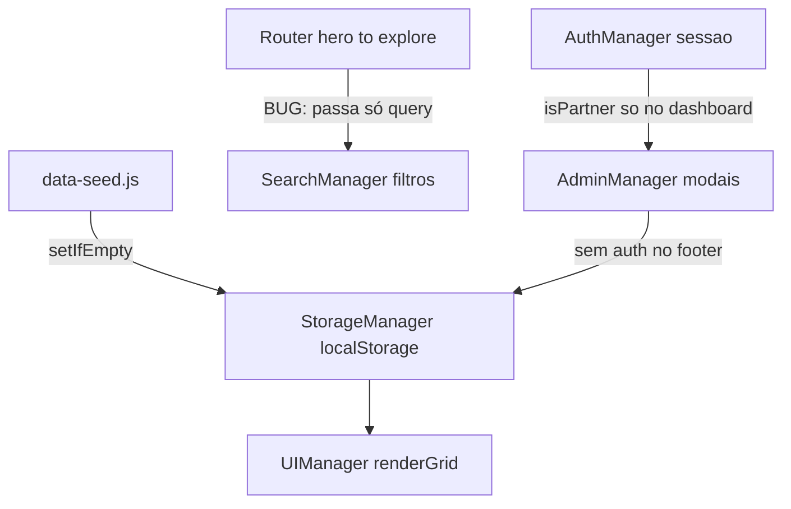
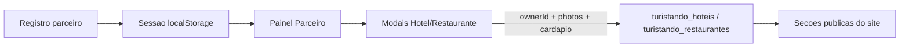

# Plano de Correção — Turistando CE

## Diagnóstico geral

O projeto é um **SPA estático** ([index.html](index.html) + módulos em [js/](js/)), sem backend. Toda a "API" é o `StorageManager` em [js/storage.js](js/storage.js), que persiste em `localStorage` com prefixo `turistando_`. Os dados iniciais vêm de [js/data-seed.js](js/data-seed.js).

A arquitetura **já prevê** cadastro, login, painel de parceiro e CRUD — mas vários bugs de integração, assets ausentes e links de desenvolvimento expostos fazem o site parecer inacabado ou quebrado.



---

## 1. Seções Destinos, Hotéis e Gastronomia vazias

**O que o usuário vê:** títulos e subtítulos, grids sem cards (ou cards quebrados).

**Causas raiz identificadas:**

| Causa | Evidência | Impacto |
|-------|-----------|---------|
| Pasta `assets/images/` **não existe** no repositório | 14 arquivos no projeto, zero em `assets/` | Todas as fotos 404 — cards parecem vazios |
| Classes CSS incompatíveis nos cards | [js/components.js](js/components.js) usa `aspect-[4/3]`; [style.css](style.css) define `.aspect-4-3` | Área da imagem colapsa; só texto visível |
| Seed não reexecuta se localStorage foi esvaziado parcialmente | `setIfEmpty()` em [js/storage.js](js/storage.js) | Grids podem ficar literalmente vazios |
| Filtro de chips de hotéis esconde 2 de 3 itens | Chip "Beira Mar" ativo por padrão em [index.html](index.html); lógica em [js/app.js](js/app.js) | Seção Hotéis parece quase vazia após interação |
| Busca inline de hotéis não conectada | `.hotel-search-input` sem listener | Campo morto na UI |

**Correção planejada:**
- Trocar `aspect-[4/3]` por `aspect-4-3` em [js/components.js](js/components.js) e adicionar utilitários CSS faltantes (`object-cover`, `overflow-hidden`).
- Atualizar [js/data-seed.js](js/data-seed.js) com **URLs de imagens reais** (Unsplash/Pexels) em vez de paths locais quebrados; aplicar o mesmo nas imagens estáticas da galeria e hero em [index.html](index.html).
- Adicionar botão/utilitário de "Restaurar dados demo" ou melhorar `seedDefaults()` para re-popular quando coleções estiverem vazias.
- Remover estado `active` padrão do chip "Beira Mar" ou aplicar filtro só após clique explícito.
- Conectar `.hotel-search-input` ao `SearchManager` filtrando `#hoteis-grid` localmente.

---

## 2. Admin exposto no rodapé (crítico)

**O que o usuário vê:** links "Admin Restaurantes/Hotéis/Destinos" no rodapé, abertos por qualquer visitante.

**Causa raiz:**
- Botões no rodapé ([index.html](index.html) linhas 641–643) disparam modais via `[data-modal-target]`.
- [js/admin.js](js/admin.js) `bindModals()` abre **sem verificar** `AuthManager.isPartner()` ou `isAdmin()`.
- `AuthManager.isAdmin()` existe em [js/auth.js](js/auth.js) mas **nunca é usado**.

**Correção planejada (alinhada ao seu pedido de conta local + empresas):**

1. **Remover** os 3 links admin do rodapé público.
2. **Proteger modais** em `AdminManager.bindModals()`: se não logado como parceiro/admin → toast "Faça login como parceiro" + abrir modal de login.
3. **Cadastro com escolha de perfil** no modal de registro: Turista / Parceiro (hotel ou restaurante) — eliminar a regra frágil de email conter "parceiro".
4. **Vincular estabelecimentos ao usuário:** adicionar `ownerId` ao salvar em [js/admin.js](js/admin.js); filtrar lista no painel em [js/router.js](js/router.js) `renderPartnerItems()` (hoje mostra **todos** os itens, linha 311).
5. **Expandir formulário de restaurante:** campo `cardapio` (textarea — pratos/preços, texto livre ou JSON simples).
6. **Expandir formulário de hotel:** campo `precoMedio` ou manter `preco` como diária média; suportar múltiplas URLs de foto (já funciona via vírgula, melhorar UX com textarea "uma URL por linha").
7. Exibir cardápio/preço no modal de detalhe em [js/ui.js](js/ui.js) / [js/components.js](js/components.js).

O painel já existe (`data-route="dashboard"` → `showDashboardView()`), visível após login parceiro via `#btn-dashboard-nav`.

---

## 3. Roteiro Inteligente parece estático

**O que o usuário vê:** "5 dias no Ceará — Personalizado" antes de gerar.

**Causa raiz:**
- O bloco `#roteiro-result` em [index.html](index.html) (linhas 402–438) contém **valores default hardcoded** no HTML ("5 dias", "Praia", "Conforto", "Casal"). Tem classe `hidden`, mas a percepção é de resultado fake porque o resumo já está preenchido e a timeline (`#roteiro-timeline`) começa vazia.
- A geração em [js/app.js](js/app.js) funciona no clique, mas:
  - `orcamento` e `companhia` **não influenciam** a seleção de hotéis/restaurantes.
  - Timeline limitada a **7 dias** mesmo com contador até 30.
  - Algoritmo é round-robin simples, não "inteligente".

**Correção planejada:**
- Substituir `#roteiro-result` por **estado vazio** inicial: mensagem "Configure suas preferências e clique em Gerar".
- Ao clicar "Gerar": spinner/loading → popular timeline → revelar resultado.
- Usar `orcamento` para filtrar hotéis via `matchesBudget()` (já existe em [js/search.js](js/search.js)).
- Respeitar `diasViagem` completo (até 30) ou limitar UI do contador a 7 com label claro.
- Esconder badge "Personalizado" até a primeira geração.

---

## 4. Busca da Hero sem feedback visível

**O que o usuário vê:** 8 campos de filtro, "Buscar" não parece fazer nada na home.

**Causa raiz — bug confirmado:**

```216:216:js/router.js
SearchManager.performSearch(params.query || '');
```

O formulário coleta `filters` completos ([js/router.js](js/router.js) linhas 51–60), mas `showExploreView()` **descarta todos os filtros** e passa só a string de destino.

Bug adicional em [js/search.js](js/search.js) linha 103: regex de `normalizeText()` corrompida — acentos podem quebrar buscas.

**Correção planejada:**
- Passar objeto completo: `SearchManager.performSearch({ filters: params.filters, query: params.query })`.
- Renderizar **chips de filtros ativos** no topo da view Explore ("Destino: Jeri • Orçamento: Conforto • ...").
- Corrigir `normalizeText()` para `.replace(/[\u0300-\u036f]/g, '')`.
- Conectar checkboxes da sidebar Explore (hoje HTML morto) ou removê-los para não confundir.

---

## 5. Mapa sem interatividade

**O que o usuário vê:** SVG decorativo + 5 nomes fixos, sem mapa real.

**Causa raiz:** seção 100% estática em [index.html](index.html) linhas 449–506; zero JS.

**Correção planejada:**
- Integrar **Leaflet.js + OpenStreetMap** (gratuito, sem API key).
- Criar [js/map.js](js/map.js): inicializar mapa centrado no Ceará; plotar markers a partir de `StorageManager.getAll('destinos')` + coordenadas no seed.
- Adicionar `lat`/`lng` em [js/data-seed.js](js/data-seed.js) para Jericoacoara, Fortaleza, Canoa Quebrada, Guaramiranga, Lençóis.
- Clique no pin → scroll para card do destino ou abrir modal de detalhe.
- Manter fallback estático se Leaflet falhar ao carregar.

---

## 6. Galeria genérica

**O que funciona:** botão "Visualizar" abre lightbox real via `openGalleryImage()` em [js/ui.js](js/ui.js).

**Problemas:** imagens 404, `alt="Galeria"` genérico, sem título/descrição.

**Correção planejada:**
- Migrar galeria para array em [js/data-seed.js](js/data-seed.js) ou bloco JS dedicado com `{ src, titulo, descricao, local }`.
- Renderizar via JS ou enriquecer HTML estático com captions visíveis no hover.
- Usar URLs externas válidas; melhorar modal com título + legenda abaixo da foto.

---

## 7. Rodapé — links mortos e #sobre inexistente

| Link | Estado atual | Ação |
|------|-------------|------|
| `#sobre` | `<div id="sobre"></div>` vazio | Criar seção completa antes do footer |
| Carreiras | `href="#"` | Remover ou link para email contato |
| Acessibilidade | `href="#"` | Apontar para `#btn-a11y-toggle` / abrir menu a11y |
| Redes sociais | `href="#"` | URLs reais ou `aria-disabled` + remover até ter perfis |
| Admin links | Públicos | Remover do rodapé (item 2) |

**Seção Sobre proposta** (antes do footer, após galeria):
- História da curadoria local, missão/valores (de [context.md](context.md)).
- Fotos da equipe ou do Ceará, CTA "Planejar viagem".
- Ancoragem `#sobre` funcional no menu e rodapé.

---

## 8. Persistência local — "container automático"

Seu pedido de guardar contas e empresas localmente **já está 80% implementado**. O plano consolida:



Melhorias específicas:
- `ownerId`, `createdAt`, `updatedAt` em cada item criado.
- Export/import JSON opcional no painel ("Backup dos meus dados") para não depender só do cache do browser.
- Validação de URL de imagem (preview thumbnail antes de salvar).

---

## Ordem de implementação recomendada

### Fase A — Site deixa de parecer quebrado (prioridade máxima)
1. Imagens via URLs externas + fix CSS dos cards
2. Fix filtros da hero (`router.js` + `search.js`)
3. Reseed / grids populados
4. Remover admin do rodapé + proteger modais

### Fase B — Painel de parceiro funcional
5. Registro com role Parceiro
6. `ownerId` + cardápio + multi-fotos
7. Dashboard filtrado por dono + editar/excluir próprios itens

### Fase C — UX e credibilidade
8. Roteiro com empty state + lógica de orçamento
9. Seção Sobre
10. Mapa Leaflet
11. Galeria enriquecida
12. Links do rodapé corrigidos

---

## Arquivos principais a modificar

| Arquivo | Mudanças |
|---------|----------|
| [index.html](index.html) | Remover admin do footer; seção Sobre; mapa Leaflet container; galeria; registro com role |
| [js/router.js](js/router.js) | Passar filtros completos; dashboard por owner |
| [js/search.js](js/search.js) | Fix normalizeText; chips de filtros ativos |
| [js/components.js](js/components.js) | Fix classes CSS; exibir cardápio |
| [js/admin.js](js/admin.js) | Auth gate; ownerId; cardápio |
| [js/auth.js](js/auth.js) | Role no registro; helper canManage() |
| [js/data-seed.js](js/data-seed.js) | URLs imagens + lat/lng |
| [js/app.js](js/app.js) | Roteiro melhorado; hotel search; chips |
| [js/ui.js](js/ui.js) | Galeria dinâmica; detalhe com cardápio |
| [js/map.js](js/map.js) | **Novo** — mapa Leaflet |
| [style.css](style.css) | Utilitários card; estilos mapa/sobre/roteiro empty |

---

## Riscos e limitações

- **Segurança real** exige backend futuro; proteção client-side impede uso casual, não um atacante determinado.
- **localStorage** é por browser/dispositivo — dados não sincronizam entre máquinas (export JSON mitiga).
- **Imagens externas** dependem de URLs permanecerem válidas; considerar pasta `assets/` com imagens commitadas depois.

## Critérios de aceite

- Visitante anônimo vê cards com foto, título e descrição em Destinos/Hotéis/Gastronomia.
- Visitante **não** vê links admin no rodapé.
- Parceiro registrado cria N hotéis/restaurantes com fotos URL e cardápio; aparecem no site e só no seu painel.
- Hero "Buscar" navega para Explore com resultados filtrados e chips indicando filtros ativos.
- Roteiro só mostra resultado após clicar "Gerar", com timeline por dia.
- Mapa Leaflet interativo com pins dos destinos.
- `#sobre` exibe conteúdo real de curadoria.
- Galeria abre lightbox com título/descrição; footer sem links `#` enganosos.
